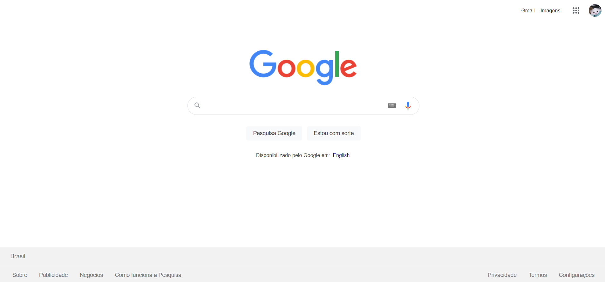
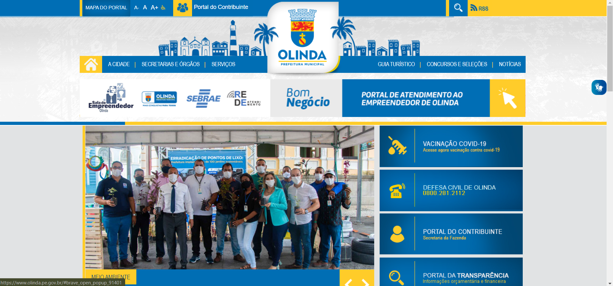
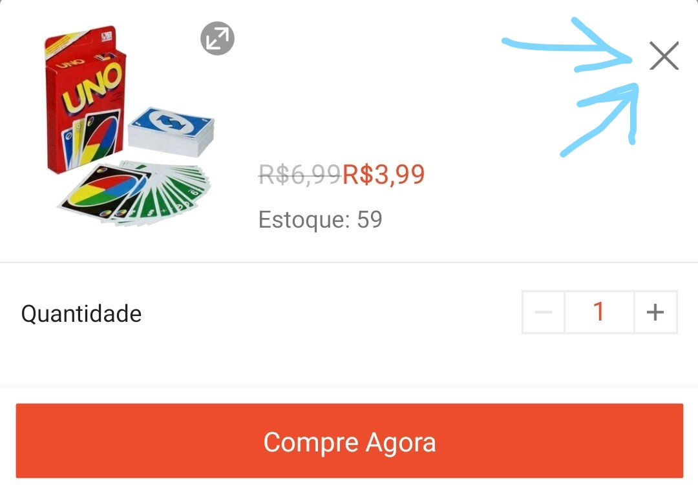
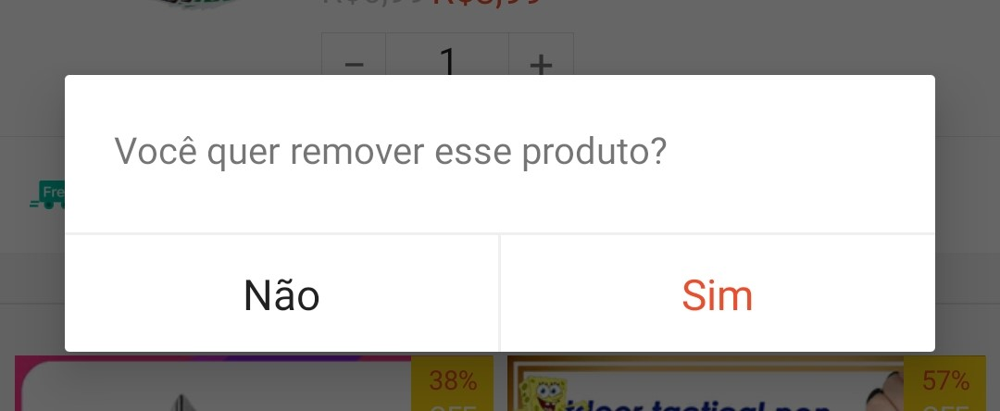

<h1 align="center">
  <a id="topo">Exemplificando algumas heurísticas</a>
</h1>

## <a id="heuristica08"> Design estético e minimalista</a>

De acordo com a heurística 08 de Nielsen, as interfaces devem garantir que o conteúdo e o design visual foquem no que é essencial. Essa heurística está relacionada ao [tópico 3.2.1 dos critérios WCAG](https://www.w3.org/WAI/WCAG21/quickref/#on-focus). Veja a seguir exemplos e contra-exemplos dessa heuristica.

### Exemplos

Um dos maiores exemplos dessa heurística é o próprio site do [Google](https://www.google.com.br/), onde a inteção principal é realzar uma pesquisa e, portanto, o foco da página vai unicamente para barra de pesquisa. Veja a seguir uma imagem que demonstra esse exemplo:

### Contra-exemplos

Ao longo da atividade, serão apresentados muitos contra-exemplos da heurística 08 de Nielsen, porém podemos destacar o site da [Prefeitura de Olinda](https://www.olinda.pe.gov.br/). Nele há muitas iformações espalhadas pela tela, o que acaba fazendo com que nenhuma delas receba o foco do usuário. Além do mais, a header do site possuí muitos detalhes chamativos que se misturam com o link para as demais páginas do site. Veja a seguir uma imagem que demonstra o exemplo:

O site da Prefeitura de Olinda citado anteriormente também serve de contra-exemplo para a situação apresentada no [slide 33](https://docs.google.com/presentation/d/1KC2SV950zGXTpaDNPUJeNcojq6uh3JMOC8hXaRz7h70/edit#slide=id.g117ff5349cb_0_20) passado pelo professor Giuliano durante a aula. Nesse slide há uma explicação sobre a importância da visão periférica. O motivo pelo qual o site da Prefeitura de Olinda serve de contra-exemplo é porque existem imagens na lateral do site que se mexem sozinhas, e isso atrapalha o usuário a focar no assunto principal.

## <a id="heuristica03"> Controle e liberdade do usuário</a>

A terceira heuristica de Nielsen propõem que sempre deve haver uma maneira claraw e simples de sair da interação atual. Veja a seguir alguns exemplos e contra-exemplos:

### Exemplos

Exemplo positivos dessa heurística podem ser facilmente encontrados em sites e aplicativos de compra e venda, como a Amazon ou a Shopee, uma vez que sempre existe a opção de cancelar a compra ou remover um produto do carrinho. Veja a seguir uma imagem que comprova o exemplo:

A imagem acima apresenta a opção de fechar o pop-up de "Comprar agora", da shopee. Também é possível realizar a retirada do produto do carrinho:

### Contra-exemplos

Um exemplo negativo para essa heurística pode ser encontrado no aplicativo TikTok. Há um pop-up na tela que fica sobre o conteúdo, e o botão para removê-lo é pequeno demais, o que o torna dificil de fechar. Isso vai contra a heurística 03 de Nielsen, que defende que deve haver uma maneira fácil para que o usuário saia de uma situação. Veja a seguir uma imagem referente ao exemplo:

